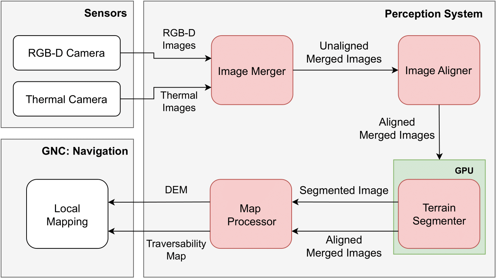

# Multimodal Navigation

*Author:* [R. Castilla Arquillo](https://github.com/raulcastar) [](https://orcid.org/0000-0003-4203-8069)

*Supervisor:* [Carlos J. Pérez del Pulgar](https://github.com/carlibiri) [](https://orcid.org/0000-0001-5819-8310)

*Contact info:* raulcastar@uni.lu


### Information

Code associated to the article: **"Multimodal Perception for Planetary Rovers Using Color, Depth, and Thermal Images".** A video of the performed laboratory test can be found at: 

<div align="center">

</div>

### Citation

If this work was helpful for your research, please consider citing the following BibTeX entry:
```BibTeX
@article{}
```

# Table of contents


1. [System information](#sys_info)
2. [Installing Docke](#docker_install)
3. [Running the code](#run_code)
4. [Activating the cameras in an Nvidia Jetson Orin Nano](#camera_activation)
5. [Possible bugs](#possible_bugs)


#  System information <a name="sys_info"></a>
This repository contains the code for a multimodal navigation system built on **ROS 2 Humble**, optimized for real-time performance on embedded platforms like the **NVIDIA Jetson Orin Nano**. The system fuses data from color and stereo images obtained from an **Intel RealSense D435i** and thermal imagery from an **Optris PI640i** thermal camera to enhance perception and navigation capabilities in challenging environments. While this implementation is tailored for these sensors, the architecture is modular and can be easily ported to other sensor configurations. A diagram of the system is provided below:

<div align="center">

</div>

# Installing Docker <a name="docker_install"></a>

An Ubuntu host system is needed to run the files located at the repo, as we use a Nvidia GPU to train the network. First of all, we must install the docker core:

```bash
$ sudo apt-get update

$ sudo apt-get install \
    apt-transport-https \
    ca-certificates \
    curl \
    gnupg-agent \
    software-properties-common
    
$ curl -fsSL https://download.docker.com/linux/ubuntu/gpg | sudo apt-key add -

$ sudo apt-key fingerprint 0EBFCD88

$ sudo add-apt-repository \
   "deb [arch=amd64] https://download.docker.com/linux/ubuntu \
   $(lsb_release -cs) \
   stable"
   
$ sudo apt-get update
$ sudo apt-get install docker-ce docker-ce-cli containerd.io

```
We install our NVIDIA card's drivers and the modules that let us use them in our docker environment:

```bash
$ sudo ubuntu-drivers autoinstall
$ sudo apt-get install -y nvidia-docker2 nvidia-container-runtime
```

# Running the code <a name="run_code"></a>

To clone this github repository with its submodules, execute:

```bash
$ git submodule update --init --recursive
```

### Amd architecture

Build the docker container for this project:

```bash
$ docker build . -f ./dockerfile/multimodal_navigation_amd.dockerfile -t muldimodal_navigation 
```

Run the docker image:

```bash
$ xhost +local:docker  ## To let docker use the screen

$ docker run -e DISPLAY=$DISPLAY -v /your/cloned/repo/location:/opt  \
  -v /tmp/.X11-unix:/tmp/.X11-unix:rw \
  --device /dev/dri --privileged \
  -v /dev/bus/usb:/dev/bus/usb \
  -v /dev/video:/dev/video \
  --ipc=host \
  --rm --gpus all \
  -it MuldimodalNavigation \
  /bin/bash
```

### Arm architecture (Jetson Orin Nano)

First, build image:

```bash
$ docker build . -f ./dockerfile/multimodal_navigation_arm.dockerfile -t muldimodal_navigation 
```

To execute the image:

```bash
$ docker run -e DISPLAY=$DISPLAY -v /your/cloned/repo/location:/opt  \
  -v /tmp/.X11-unix:/tmp/.X11-unix:rw \
  --device /dev/dri --privileged \
  -v /dev/bus/usb:/dev/bus/usb \
  -v /dev/video:/dev/video \
  --ipc=host \
  --net=host \
  --rm \
  --runtime nvidia \
  -it omniunet \
  /bin/bash
```

# Activating the cameras in an Nvidia Jetson Orin Nano <a name="camera_activation"></a>

To install the OS in a NVMe SSD of the Jetson, you need to do it through the [Nvidia SDK Manager](https://docs.nvidia.com/sdk-manager/install-with-sdkm-jetson/index.html). [Here](https://forums.developer.nvidia.com/t/how-to-get-into-recovery-mode/250525) is a link to important recovery mode info.

### Realsense camera (Realsense D435i)
The realsense UVC interface doesn't work, so the realsense source code needs to be recompiled using the RSUSB backend (done in the docker image): 

```bash
# Compile realsense camera drivers
$ git clone https://github.com/IntelRealSense/librealsense.git
$ cd librealsense && mkdir build && cd build && \
  cmake .. -DBUILD_EXAMPLES=true -DCMAKE_BUILD_TYPE=release -DFORCE_RSUSB_BACKEND=true -DBUILD_WITH_CUDA=true && \
  make -j4 && make install
```

### Thermal camera (Optris PI 640i)
First, check if the USB HIDRAW interface is enabled to use the thermal camera, otherwise, a /dev null error will be prompted when trying to access it through the `init()` function of its SDK. Execute:

```bash
$ zcat /proc/config.gz | grep 'HIDRAW'

# If you get
CONFIG_HIDRAW=n
```
The kernel must be recompiled for the changes to be applied. For the Nvidia Jetson Orin, the OS version was Jetpack 6.0 Developer Preview (DP), or Jetson Linux 36.2. To recompile the kernel, first download the Driver Package (BSP) Sources from [here](https://developer.nvidia.com/embedded/jetson-linux-r362). The download file would be `public_sources.tbz2`, unzip it, and uncompress the kernel file `/Linux_for_Tegra/source/kernel_src.tbz2`. Inside the folder `kernel_src`, create a directory named `kernel_out`. Modify the config file `source/kernel_src/kernel/kernel-jammy-src/arch/arm64/configs/defconfig` to add the following lines at the end:

```bash
CONFIG_HIDRAW=y
CONFIG_UHID=y
CONFIG_HID_GENERIC=y
```
Then, execute the following inside the `kernel_src` directory:

```bash
./nvbuild.sh -o $PWD/kernel_out
```

Finally, do the following: 
- Copy newly built kernel image from `kernel_out/kernel/kernel-jammy-src/arch/arm64/Image` to `/boot/Image`.
- Copy everything from `kernel_out/arch/arm64/boot/dts/nvidia/` to `/boot/dtb/`.
- Reboot.

Check again that the module is activated:
```bash
$ zcat /proc/config.gz | grep 'HIDRAW'

# You should get
CONFIG_HIDRAW=y
```

# Possible bugs <a name="possible_bugs"></a>

Execute `sudo apt remove uvcdynctrl` to fix bug of /var/log/uvcdynctrl-udev.log totally filling the SSD disk.

If docker has problems to start, execute:

```bash
$ sudo apt reinstall docker-ce
$ sudo groupadd docker
$ sudo gpasswd -a $USER docker
$ newgrp docker
```
